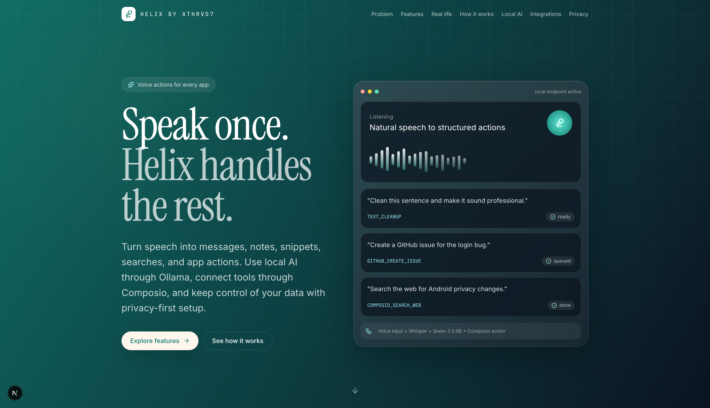
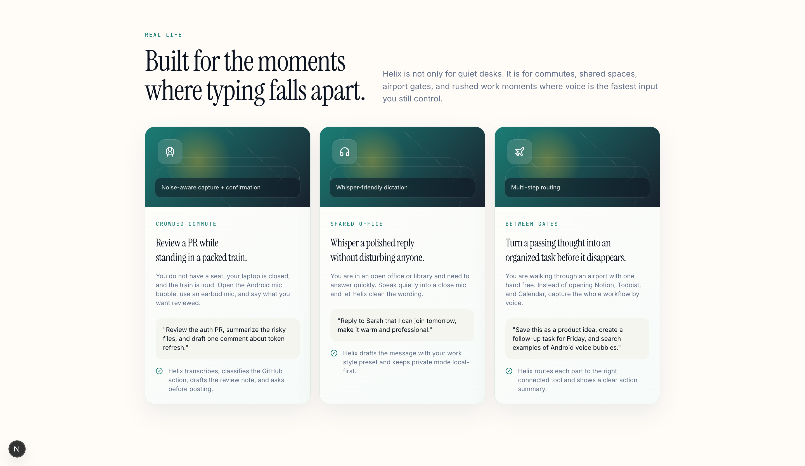
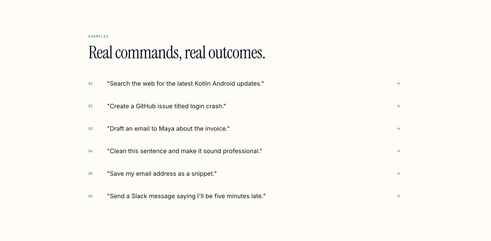

# Helix by athrvd7

## Voice Actions For Every App

**Speak once. Helix handles the rest.**

Helix by athrvd7 is a local-first voice command layer for desktop, Windows, and Android. It turns natural speech into messages, notes, snippets, searches, and real app actions using local AI through Ollama, intent routing with Qwen 3 0.6B, and tool execution through Composio.

[See How It Works](#how-it-works) · [Integrations](#integrations)

---



---

## Hackathon Snapshot

Helix was built around one core idea:

> Voice should not just write words. Voice should trigger outcomes.

This project demonstrates:

- **Natural speech to structured actions**: spoken requests become tool names, parameters, and executable workflows.
- **Local-first AI routing**: Qwen 3 0.6B runs through Ollama for focused intent classification.
- **Private speech pipeline**: Whisper-style transcription and local model routing keep the core workflow user-controlled.
- **1000+ app potential through Composio**: one voice layer can route actions to Gmail, GitHub, Slack, Calendar, Notion, Todoist, Docs, search, and many more tools.
- **Desktop + Android surfaces**: Tauri desktop app plus a Kotlin Android voice bubble concept.

---

## The Why

We have all been there: you are writing a reply, filing a bug, capturing a thought, or searching for something urgent, and the workflow gets broken by app switching.

You open one app, type a prompt, copy the result, paste it somewhere else, clean the wording, then repeat the same context in another tool.

Dictation apps only solve the first step. They turn voice into text, but they still leave the user to finish the work.

Helix acts like a command bar for your voice. You speak naturally, Helix understands the intent, maps it into a structured action, and routes it to the right tool.

---

## Product Snapshot

```text
local endpoint active
Listening

Natural speech to structured actions

"Clean this sentence and make it sound professional."
-> TEXT_CLEANUP
-> ready

"Create a GitHub issue for the login bug."
-> GITHUB_CREATE_ISSUE
-> queued

"Search the web for Android privacy changes."
-> COMPOSIO_SEARCH_WEB
-> done

Voice input > Whisper > Qwen 3 0.6B > Composio action
```

---

## Use Cases



### 1. Crowded Commute

**Review a PR while standing in a packed train.**

You do not have a seat, your laptop is closed, and the train is loud. Open the Android mic bubble, use an earbud mic, and say what you want reviewed.

```text
"Review the auth PR, summarize the risky files, and draft one comment about token refresh."
```

Helix transcribes the request, classifies the GitHub action, drafts the review note, and asks before posting.

### 2. Shared Office

**Whisper a polished reply without disturbing anyone.**

You are in an open office or library and need to answer quickly. Speak quietly into a close mic and let Helix clean the wording.

```text
"Reply to Sarah that I can join tomorrow, make it warm and professional."
```

Helix drafts the message with your work style preset and keeps privacy mode local-first.

### 3. Between Gates

**Turn a passing thought into an organized workflow before it disappears.**

You are walking through an airport with one hand free. Instead of opening Notion, Todoist, and Calendar, capture the whole workflow by voice.

```text
"Save this as a product idea, create a follow-up task for Friday, and search examples of Android voice bubbles."
```

Helix routes each part to the right connected tool and shows a clear action summary.

---



---

## What It Does

- **Voice actions across apps**: turn spoken commands into messages, notes, snippets, searches, and tool actions.
- **Local intent routing**: run Qwen 3 0.6B through Ollama for fast local classification.
- **Composio tool execution**: connect spoken intent to Gmail, GitHub, Slack, Calendar, Notion, Todoist, Docs, and web search.
- **Writing cleanup**: dictate rough thoughts and turn them into cleaner, more useful text.
- **Snippets**: save reusable phrases, prompts, emails, and shortcuts.
- **Dictionary**: teach Helix names, project terms, emails, and phrases you use often.
- **Style presets**: shape output for personal, work, email, or formal writing.
- **Privacy mode**: keep local workflows on your device.
- **Android voice bubble**: mobile voice entry point designed for quick capture from anywhere.
- **Windows desktop app**: Tauri desktop app with local transcription, Ollama settings, and app actions.

---

## How It Works

Helix is intentionally built around a simple pipeline.

```text
Record -> Transcribe -> Classify -> Execute -> Confirm result
```

### 01. Record

Helix captures your voice from the Windows desktop app or Android voice bubble.

### 02. Transcribe

Whisper converts speech into text locally.

### 03. Classify

Qwen 3 0.6B maps the text into a structured action.

### 04. Execute

Composio or local tools complete the task.

### 05. Confirm

Risky actions can be reviewed before they are sent, posted, or saved.

---

## Local AI

### Qwen 3 0.6B: small model, focused job

Helix does not use Qwen as a large chatbot. It uses Qwen 3 0.6B for one focused task: convert speech text into structured intent.

That means the model does not need to write a long answer. It only needs to return a tool name and parameters.

```text
User:
"Search the web for OpenAI official website"

Qwen 3 0.6B:
{
  tool: "COMPOSIO_SEARCH_WEB",
  parameters: {
    query: "OpenAI official website"
  }
}

Helix:
execute(action)
```

Why this works:

- Small enough to run locally
- Fast enough for intent routing
- No cloud LLM required for core classification
- Easier to validate than open-ended chat
- Upgradeable later for larger local or hosted models

---

## Integrations

One voice layer for the tools you already use.

**Helix connects to 1000+ app actions through Composio.** Instead of hardcoding a few integrations, Helix uses Composio as the action layer so spoken intent can reach the apps people already work in.

| App | Example command |
| --- | --- |
| Gmail | "Draft an email to Alex about the project update." |
| Calendar | "What meetings do I have tomorrow?" |
| GitHub | "Create an issue for the login button bug." |
| Slack | "Tell the team I am joining late." |
| Notion | "Create a note from this idea." |
| Todoist | "Add a follow-up task for Friday." |
| Docs | "Turn this into a clean meeting summary." |
| Web Search | "Find the best local AI models for Android." |

The product direction is simple:

> One voice command layer for 1000+ apps.

---

## Desktop And Android

### Windows Desktop App

- Tauri desktop runtime
- React interface
- Local Whisper transcription server
- Ollama endpoint settings
- Qwen 3 0.6B model support
- Composio action execution
- Global shortcut support
- Local environment configuration

### Android App

- Kotlin Android app
- Floating mic bubble concept
- Permission-first onboarding
- Local model setup
- Privacy mode
- Dictionary, style, and snippets
- Advanced setup for backend configuration
- Optional account sync path

---

## Tech Stack

| Layer | Technology | Purpose |
| --- | --- | --- |
| Desktop app | Tauri, Rust, React | Windows desktop voice assistant |
| Android app | Kotlin, Material Views | Mobile voice bubble and onboarding |
| Speech-to-text | Whisper tiny | Local transcription |
| Local model | Qwen 3 0.6B through Ollama | Intent classification |
| Tool execution | Composio | App and workflow actions |
| Sync-ready backend | Supabase | Optional account and settings sync |

---

## Model Declaration

| Model | Size | Where it runs | Role |
| --- | --- | --- | --- |
| Whisper tiny | 61M parameters | Local | Speech-to-text |
| Qwen 3 0.6B | 0.6B parameters | Ollama / local endpoint | Intent routing |

---

## Privacy

Helix is designed around local-first control.

- Core intent routing can run through your own Ollama endpoint.
- Privacy mode keeps data stored on your device.
- Cloud sync is optional.
- App integrations are optional and user-controlled.
- Secrets live in local environment files or app settings, not in source code.
- `.env`, local properties, credentials, and build outputs are ignored by git.

---

## Getting Started

### Prerequisites

- Node.js 18+
- Rust toolchain
- Ollama
- Python 3.10+ for the local Whisper server
- Composio API key for connected app actions

### Desktop Setup

```bash
git clone <repository-url>
cd Helix
npm install
ollama pull qwen3:0.6b
```

### Local Environment

Copy `.env.example` to `.env` for machine-specific desktop settings. `.env` is ignored by git.

```bash
HELIX_LLM_ENDPOINT=http://localhost:11434
HELIX_LLM_MODEL=qwen3:0.6b
HELIX_WHISPER_MODEL=tiny
HELIX_COMPOSIO_API_KEY=
```

Do not commit API keys, local network addresses, Privy credentials, Supabase secrets, or user credentials. Android users enter local Ollama and advanced backend settings inside the app; desktop development can read them from `.env`.

### Privy Auth Setup

Android cloud sync uses Privy for user-facing email code sign-in. Wallet login is not enabled in the app.

For development:

1. Create a Privy app at https://dashboard.privy.io.
2. Enable email login.
3. Copy the App ID and App client ID.
4. Copy `android/local.properties.example` to `android/local.properties`.
5. Fill in:

```properties
privy.app.id=your-privy-app-id
privy.app.client.id=your-privy-app-client-id
```

`android/local.properties` is ignored by git. Do not put the Privy app secret in the Android app.

Run the desktop app:

```bash
npm run tauri -- dev
```

### Android Setup

```bash
cd android
./gradlew assembleDebug
adb install app/build/outputs/apk/debug/app-debug.apk
```

First launch opens the Helix onboarding flow:

1. Choose private local setup, cloud sync setup, or try without account.
2. Grant microphone and accessibility permissions.
3. Tune the floating voice bubble.
4. Configure Ollama only if you chose local setup.
5. Sign in only if you chose cloud sync.
6. Finish with dictionary, style, and snippets personalization.

Normal users sign in with Privy email codes. Supabase remains a database/backend provider and its project settings live under Advanced setup for developers only.

---

## Local Ollama Setup

Run Ollama on your computer and keep your phone on the same Wi-Fi.

```bash
ollama pull qwen3:0.6b
OLLAMA_HOST=0.0.0.0:11434 ollama serve
```

In the Android app, enter:

```text
Ollama endpoint: <computer-lan-ip>:11434
Model: qwen3:0.6b
```

Use Test connection before continuing. The app validates blank endpoints, invalid host and port formats, failed network requests, and missing models.

---

## Backend Advanced Setup

Supabase is used for database/backend storage only. User authentication is handled by Privy. Do not commit project URLs, anon keys, service-role keys, or user credentials.

For development:

1. Create a Supabase project.
2. Copy the project URL and anon public key.
3. Open Advanced setup in the Android app.
4. Paste the URL and anon key.
5. Save backend settings. Sign-in still happens through Privy email codes.

Secrets are stored in Android app preferences for local testing. Use platform-secure storage before production release.

### GitHub Releases Distribution

For hackathon and beta distribution, publish builds through GitHub Releases:

1. Build the Android APK and upload it as a release asset.
2. Build the Tauri desktop installer and upload the installer for each target OS.
3. Include this note in Android release descriptions:

```text
Android install note: this APK is distributed outside Google Play. You may need to allow "Install unknown apps" for your browser or file manager before installing.
```

Use Google Play Console and signed desktop installers for broader public release.

### Privacy Mode

Privacy mode keeps data stored only on your device. Local model setup routes intent classification through your own Ollama endpoint instead of a hosted model. Composio actions still require the permissions and integrations you explicitly connect.

## Known Limitations

- Very noisy environments can reduce transcription quality.
- Small models can misclassify vague requests.
- Multi-step actions need careful confirmation.
- Some Composio actions require connected user accounts.
- Long dictation may need a larger speech model for better accuracy.
- Android voice bubble and sync flows are still evolving.

---

## Project Structure

```text
Helix/
├── src/                 # React desktop UI
├── src-tauri/           # Rust and Tauri desktop runtime
├── android/             # Kotlin Android app
├── scripts/             # Local helper scripts
├── public/              # Static assets
├── package.json         # Desktop dependencies and scripts
└── README.md
```

---

## License

MIT

---

**Helix - Voice actions for every app**

Local-first voice routing for desktop, Windows, and Android.
